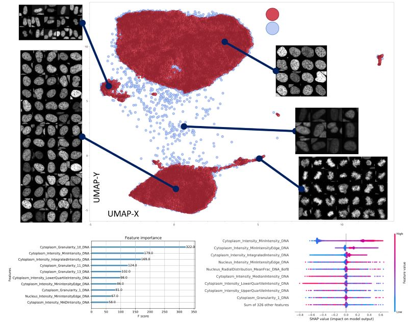

# UMAP-Explorer

UMAP-Explorer is a comprehensive tool designed for high-dimensional cell morphology data analysis. Leveraging the power of UMAP (Uniform Manifold Approximation and Projection) for dimension reduction, this package provides a streamlined workflow for transforming complex morphological data into intuitive, two-dimensional representations. Further functionalities, including advanced clustering and detailed analytical tools, facilitate the extraction of meaningful insights from Cell Profiler data.


## Features

* **UMAP Embedding:** Reduce the dimensionality of your high-dimensional cell morphology data, making it easier to visualize and interpret.

* **Clustering:** Apply clustering algorithms - HDBScan and Leiden clusterin - to identify distinct groups or patterns in your data.

* **Analysis Tools:** Use our analytical tools to delve deeper into the characteristics and structure of your data including cluster comparison by XGBoost/SHAP analysis, cluster extraction and re-embedding.

## Installation

```bash
# Install UMAP-Explorer from GitHub
pip install git+https://github.com/yourusername/UMAP-Explorer.git

import UMAP_Explorer as ue

# Load your data
data = ue.load_data('path/to/your/data.csv')

# Perform UMAP embedding
embedding = ue.umap(data)

# Perform clustering
clusters = ue.cluster(embedding)

# Analyze the clusters
analysis = ue.analyze(clusters)
